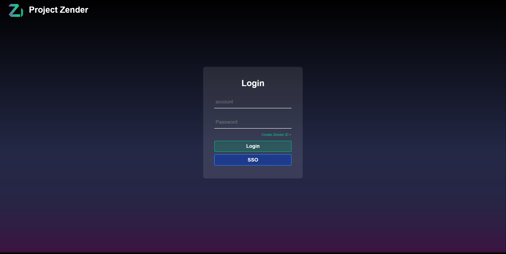
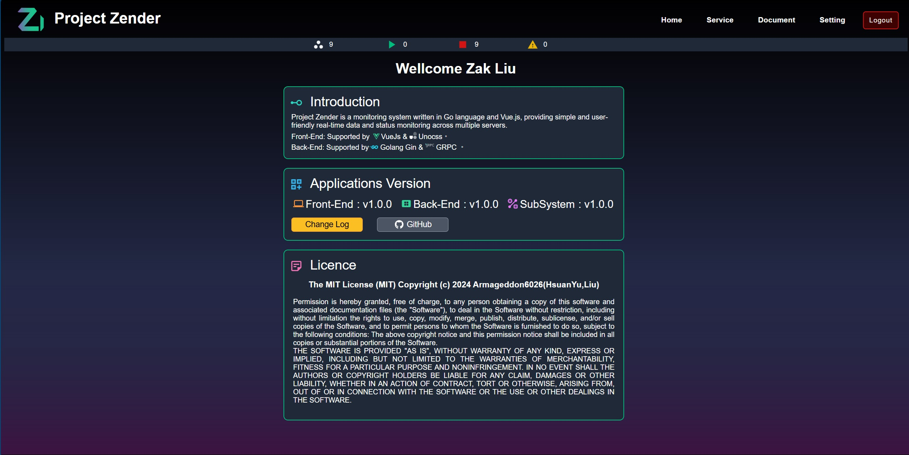
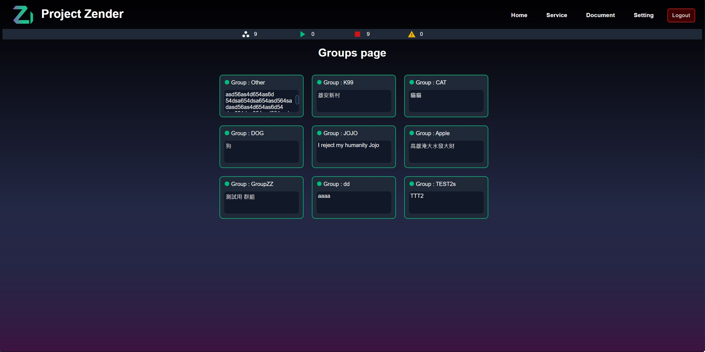
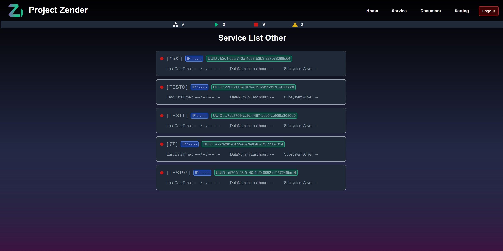
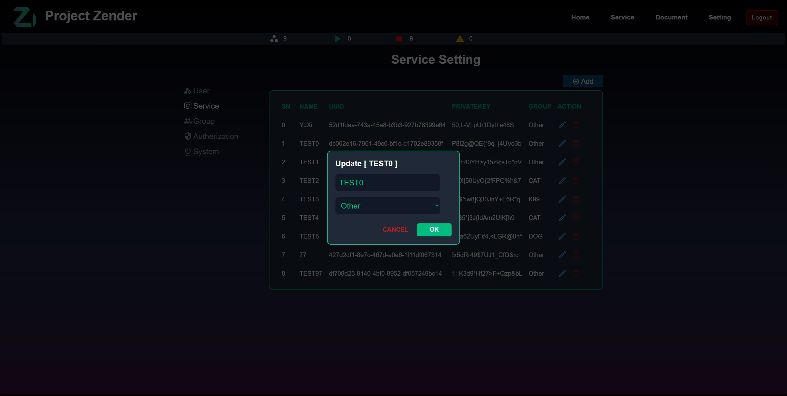
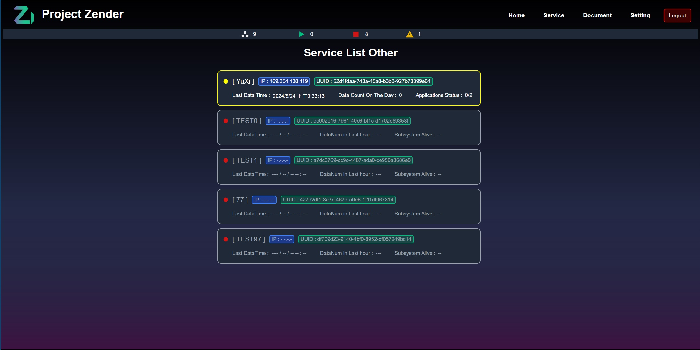

# Zender

[](https://go.dev/)
[](https://nodejs.org)
[](https://github.com/Armageddon6026/zender/blob/master/LICENSE)


---
Zender is a monitoring system written in Go + Vue3, providing simple and user-friendly real-time data and status monitoring across multiple servers.


<table>
  <tr>
     <td width="50%" align="center"><b>Login</b></td>
     <td width="50%" align="center"><b>Home</b></td>
  </tr>
  <tr>
     <td></td>
     <td></td>
  </tr>
  <tr>
      <td width="50%" align="center"><b>Group</b></td>
      <td width="50%" align="center"><b>Service</b></td>
  </tr>
  <tr>
     <td></td>
     <td></td>
  </tr>
  <tr>
      <td width="50%" align="center"><b>Setting</b></td>
      <td width="50%" align="center"><b>Status Notification</b></td>
  </tr>
  <tr>
     <td></td>
     <td></td>
  </tr>
</table>

## Features
Server support features:
- Restful api, write by gin
- MVC structure
- Mariadb storage, via self-made orm libirary
- Graceful shutdown
- Authentication, support jwt
- GRPC supported
- SSE supported
- Container application management, support docker/podman

Frontend support features:
- Vue3 supported
- Unocss CSS
- Build with vite
- Basic Login
- SSE supported,via [fetch-event-source](https://github.com/Azure/fetch-event-source)

TODOs
- [ ] Redis cache
- [ ] Jwt balck list 
- [ ] Request rate limit
- [ ] Oath2 Authentication
- [ ] Mobile UI 
- [ ] Registry page
- [ ] document page

## Get started
Before starting, you should already install [golang](https://go.dev/), [docker](https://docs.docker.com/engine/install/)/[podman](https://podman.io/docs/installation) , [mariadb](https://mariadb.org/) and [nodejs](https://nodejs.org/en/download/) in your develop env.
### Build & Run server

Env:
- golang (1.22 or later)

>You can change server and database setting in conig/server.json

```bash
go mod download
go build
```

run locally
```bash
./zender
```

> You can build database by script in script/database.sql

### Test api
See more api in https://localhost:8081/document

Login, get jwt token
> Only admin user can access any apis, other user need create RBAC policy
```bash
curl -v -u 'account:password' https://localhost:8081/pai/v1/login
```
Response as follows, set token in cookie with `x-access-token` Header
```json
{
    "x-access-token" : "my-jwt-token"
}
```

Get users
```bash
token="my-jwt-token"
curl --cookie "x-access-tokeny={ my-jwt-token }" "https://localhost:8081/pai/v1/user"
```

### Build & Run UI

Env:
- node (20 or later)

Build ui
```bash
cd web
npm install --legacy-peer-deps
npm run build
```

Run ui with vite
```bash
cd web
npm run dev 
```
Before run,You sould check `vite.config.mts` first
>See [Vite Configuration Reference](https://vitejs.dev/config/).

View Web
- Explore in http://localhost:5173 for dev (use `vite` server)

- Explore in https://localhost:8081 for realse (use `zender` server)

Default admin account/password is `Zak/12345`


### Container build & Run

run server in docker/podman
```bash
# build image
docker(podman) build -t zender:latest .
# run server
docker(podman) run --detach --name zenfer-server --env GIN_MODE=release  zender:latestt
```

> build database, see [Mariadb Official Image](https://hub.docker.com/_/mariadb)
